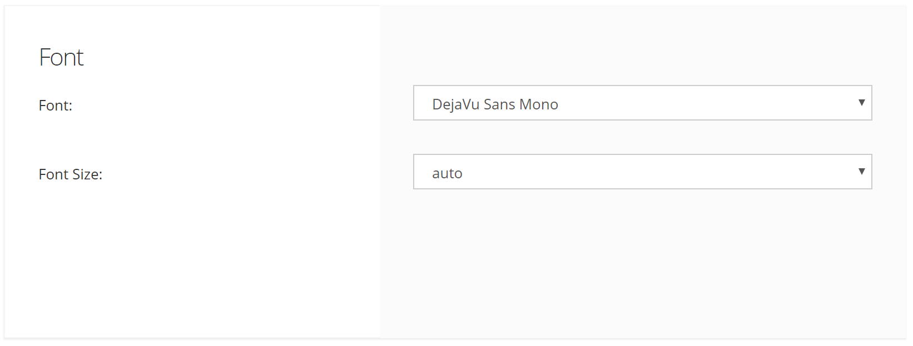
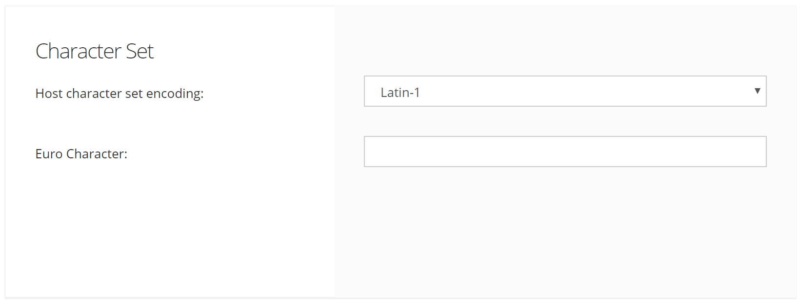

# Font & Character Settings

<PageHeader />

**Created At:** 8/16/2019 6:07:31 PM  
**Updated At:** 11/15/2019 6:14:24 PM  
**Original Doc:** [accuterm-8-font-character-set](https://docs.zumasys.com/accuterm/accuterm-8-font-character-set)  
**Original ID:** 444197  
**Internal:** No  

## Font

| <!----> | <!----> |
| --- | --- |
| Font: | The Font drop-down list shows all of the available fonts installed on your computer that are suitable for use with AccuTerm. In order for a font to be considered suitable, it must be fixed-pitch (most Windows fonts are not fixed-pitch), and it must support the ANSI character set. AccuTerm uses the open-source DejaVu Sans Mono font by default. |
| Font Size: | The Size list shows the font sizes available for the selected font. Choose "auto" if you want the font to scale to fit the screen size. This is the default. |

## Character Set

Select the character set encoding that is used by the application running on the host. Most terminals have one or more native character sets - these are always included in the character set encoding list and are the most common choice. The current Windows ANSI character set is also included in the character setlist. Select this encoding if your host application is using the same ANSI character set that Windows is using. If your application uses Unicode sends and receives data using UTF-8, select the Unicode (UTF-8) encoding. Other single-byte character sets that are installed in Windows may be also be selected. For VT220, 320 & 420 emulations, the selected character set is used when AccuTerm receives the SCS (select character set) command to select the UPSS (user-preferred supplemental set). You should select a font that supports all the characters used by your application. Windows includes a feature known as "Font Linking" which enables the use of characters (actually, glyphs) from a similar font if a required glyph is missing from the selected font. This sometimes yields poor results, so the selection of an appropriate font is important. Font Linking is not supported for bitmap fonts.

| <!----> | <!----> |
| --- | --- |
| Euro Character: | If your host application needs to display the Euro currency symbol, enter the ASCII value of the Euro symbol, as used on your system. Note: for most character sets there is no standard value for this symbol. Some possible values are 128 (Windows ANSI), 164 (Latin-1 currency and Latin-9 Euro) and 213 (IBM modified code page 850). Unicode (UTF-8) defines the Euro as U+20AC. If you are using Unicode encoding, the Euro character value is ignored. |

