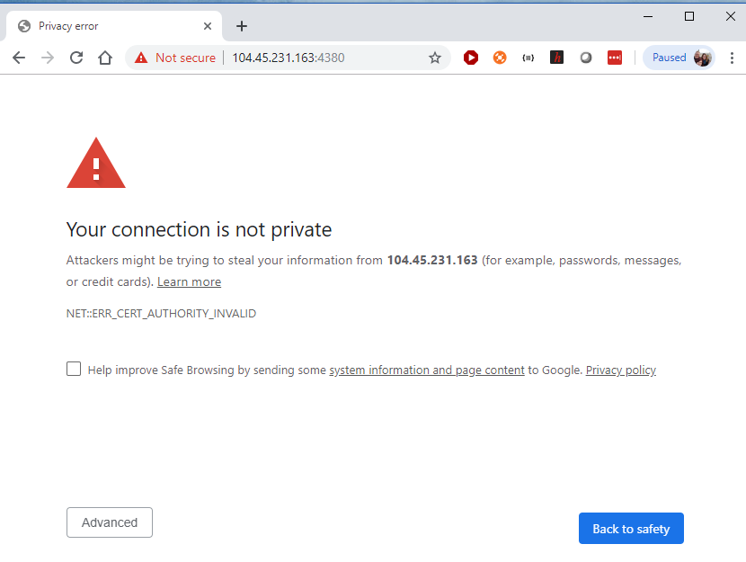

# Installing AccuTerm IO Server

<PageHeader />

**Created At:** 8/8/2019 1:20:16 AM  
**Updated At:** 9/17/2019 12:04:25 AM  
**Original Doc:** [accuterm-8-installing-accuterm-web-server-package](https://docs.zumasys.com/accuterm/accuterm-8-installing-accuterm-web-server-package)  
**Original ID:** 441431  
**Internal:** No  


### Info

You will need to make sure you have the appropriate root permissions to install AccuTerm IO on the server.

## Installing AccuTerm IO Server

1. Download the [AccuTerm IO Server installation package](https://www.zumasys.com/downloads/) from the Zumasys Downloads page. You can download the installer directly in Linux with the following commands.  Just cut and paste into your Linux console.

```
wget https://zdownload.blob.core.windows.net/accuterm/-AccuTerm-IO-Server/Linux/x86/0.1.5.0/install-accutermio.bin
or
curl -O https://zdownload.blob.core.windows.net/accuterm/-AccuTerm-IO-Server/Linux/x86/0.1.5.0/install-accutermio.bin
```

2. Allow the install-accutermio file to be executable.

```
chmod +x install-accutermio.bin
```


3. Run the installer.

```
./install-accutermio.bin
```


3. Press enter to start the installation process.


4. Specify the installation directory or press enter to accept the default path (/opt/accutermio).


5. Specify the port you wish for AccuTerm IO to use or press enter to accept the default port (4380).


6. Setup the systemctl service for AccuTerm Web.


7. Update your firewall to allow access to your defined port (default 4380).


8. The installer will by default create you a self-signed cert.  You must supply a DNS name for your server.  If you do not use a DNS  you can use an IP address instead.  Please read the section on Security to fully understand certs and how to later create fully signed certs.


9. The installer will now run and generate your self signed cert and start up the AccuTerm IO service


10. AccuTerm IO Server is now installed.  Let's now test to make sure your workstation can talk to the server.  Open up Chrome or Firefox and open up the test status page.



This error is because we are using a self-signed cert.  Accept this site click the Advanced Button and choose the Proceed link. The page should respond with a simple 1.  Please read below about Server Security to understand certs and how to install a fully signed cert and remove this error.  While using the self-signed cert each workstation that wishes to connect will need to go directly to the above page and choose to proceed.

**Now the server is installed and running and you have accepted the self signed cert you need to build your users and profiles.  Accuterm is actually launched from accuterm.io and your profiles are built at portal.zumasys.com**

[https://docs.zumasys.com./../accuterm-8-getting-started](./../accuterm-8-getting-started)

## Manage AccuTerm IO Server

AccuTerm IO is installed as a Linux systemctl service.

```
systemctl status accutermio
systemctl stop accutermio
systemctl start accutermio
```

## Run AccuTerm IO Server in debug mode

As root do

```
systemctl stop accutermio
cd /opt/accutermio
export DEBUG=express:*
./accutermio-linux
```

## Configure AccuTerm IO Server as Jump Box

By default, AccuTerm IO will call the default Linux /bin/login program.  If you are wanting to connect to an AIX or Windows server from a Linux machine with AccuTerm IO server installed you can modify the /opt/accutermio/config.json.

```
{
        "port" : 4380,
        "ssl_cert" : "./keys/server_cert.pem",
        "ssl_key" : "./keys/server_key.pem",
        "static_dir" : "./assets",
        "heartbeat" : 60,
        "close_on_heart_failure" : true,
        "trust_proxy" : false,
        "command" : "/usr/bin/telnet",
        "command_args" : ["<ip of your telnet server", "23 - Or custom port for telnet"],
        "defaults" :
        {
                "term" : "vt100",
                "cols" : 80,
                "rows" : 24
        }
}
```

Now restart the AccutermIO service and it should now respond with the telnet prompt of your Pick Box.  This technique can also be used to replace /bin/login also with any other alternative login technique.  For example, you could use the following script to use SSH access instead.


## Notes on AccuTerm IO Server and Security

AccutermIO is a true web application and as such it relies on normal [web certificates](https://www.websecurity.symantec.com/security-topics/what-is-ssl-tls-https) (https) for security.  Certs can be either purchased from sites such as [DigiCert](https://www.digicert.com/)or free ones an be obtained by [ACME](https://en.wikipedia.org/wiki/Automated_Certificate_Management_Environment) based services such as [Let's Encrypt](https://letsencrypt.org/).

In order to install a real cert you will need

1. A true DNS entry for your server that can be resolved on the internet.
2. Access to that DNS to add a special TXT record for authentication.
3. Root access to the server where AccutermIO is installed to run the cert program.


If you do not have #1 or #2 you can use a free DNS service to give you a DNS name for your server.

Free DNS service:  [https://www.duckdns.org](https://www.duckdns.org)

ACME client to install CERT: [https://github.com/Neilpang/acme.sh](https://github.com/Neilpang/acme.sh)

ACME example with DuckDNS: [https://github.com/Neilpang/acme.sh/wiki/dnsapi#27-use-duckdnsorg-api](https://github.com/Neilpang/acme.sh/wiki/dnsapi#27-use-duckdnsorg-api)


