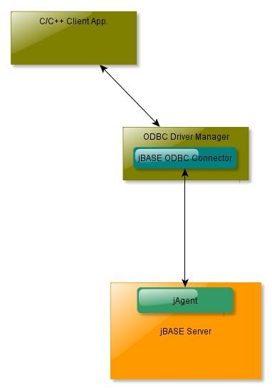
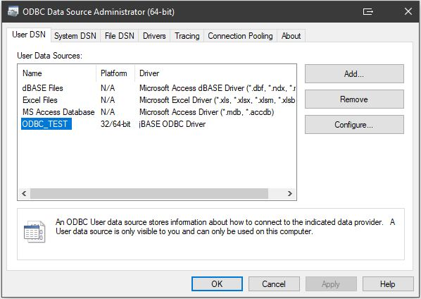

# Introduction to ODBC

**Created At:** 4/12/2017 9:21:51 PM  
**Updated At:** 1/15/2020 11:21:59 PM  
**Original Doc:** [251010-introduction-to-odbc](https://docs.jbase.com/30312-jagent/251010-introduction-to-odbc)  
**Original ID:** 251010  
**Internal:** No  

**Tags:**
<badge text='sql' vertical='middle' />
<badge text='odbc' vertical='middle' />

## Introduction

The **jBASE ODBC Connector** is an ODBC driver implementing the Open Database Connectivity (ODBC) 3.0 API. This driver release supports a driver-manager based and Unicode compliant interface, featuring support for transactions and calling stored procedures. The ODBC Connector is only available to Windows platforms but SQL requests may be issued against a remote jBASE instance running on other platforms.



**jAgent** is a jBASE component responsible for accepting and processing incoming client requests.

As shown in this diagram, jAgent must be running to accept and dispatch SQL requests to the jBASE Server. jAgent, as well as ODBC, use TCP socket connections to communicate with each other and therefore need to be configured to use the same TCP port. More details about jAgent may be found in the jAgent user guide and via this [link](/_questions/229890).

The **ODBC Driver Manager** is a system component which on Windows is part of the MDAC (Microsoft Data Access Components) package and automatically included with the latest Windows operating systems. Odbcad32.exe is the 32bit/64bit ODBC Data Source Administrator and odbc32.lib/ odbccp32.lib are import libraries to be used by client applications.

## Assumptions

Fore more information about the ODBC API and how to use it, refer to

[https://docs.microsoft.com/en-us/sql/odbc/reference/syntax/odbc-api-reference](https://docs.microsoft.com/en-us/sql/odbc/reference/syntax/odbc-api-reference?view=sql-server-2017)

If the ODBC driver is to be used to develop client applications accessing a jBASE instance, the following prerequisite knowledge is required:

- C
- General DBMS knowledge
- jBASE and concepts of Multivalue databases
- Secure Sockets Layer (SSL) protocol

## System requirements

The ODBC Connector is supported on the following platforms:

- jBASE 5.x for Windows

The following system components must be installed prior to installing the ODBC Connector:

- Visual C++ run-time components -  version 8.0.50727.762 or higher

These run-time libraries can be downloaded from Microsoft and are supplied with the following package:

***Visual C++ 2005 SP1 Redistributable Package (x86)***

Note that these run-time components are already included in:

***Microsoft .NET Framework 2.0 SP1 or higher***

Installation of the Visual C++ 2005 SP1 redistributable package is not required if this version of .NET has already been installed.

## Configuration

### Package contents

The ODBC Connector is included in jBASE but may also be deployed on Windows operating systems which do not have jBASE installed. A self-contained installer (from now on mentioned as ODBC installer) is available which installs and registers the ODBC driver. Below is the list of release packages containing the ODBC Connector:

- 64-bit Windows jBASE 5.x ([Client Software Download](https://zdownload.blob.core.windows.net/jbase/ODBC/Windows/x64/1.2.0.0/jodbc64.msi))
- 32-bit/64-bit Windows ODBC Installer  ([Client Software Download](https://zdownload.blob.core.windows.net/jbase/ODBC/Windows/x86/1.2.0.0/jodbc32_WIN64.msi))

The ODBC installer deploys the following files:

- jodbc.dll                        jBASE ODBC driver library
- libjODBCSetup.dll        jBASE ODBC Setup libraryll
- libjcf.dll                          JCF (jBASE Communication Foundation) library
- ACE.dll                           ACE (Adaptive Communication Environment) libraries
- ACE\_SSL.dll
- lib-ssl1\_1-x64.dll          OpenSSL libraries
- libcrypto-1\_1-x64.dll
- icuuc40.dll                    ICU (International Components for Unicode) libraries
- icudt40.dll
- msvcr80.dll                   MS VC8 run-time library required by the OpenSSL libraries

## Note

> The ODBC installer copies the ODBC driver and setup libraries to the Windows\System32 directory.

**ODBC Setup library** is a separate library implementing the ODBC Setup API required by the driver manager to display graphical components such as connection dialogs. Connection dialogs enables users to configure DSNs inside Windows’ ODBC Manager (odbcad32.exe) or input connection details when requested by the driver.

### Installing the driver

The ODBC installer will automatically register the ODBC driver and ODBC Setup libraries. The registration process is required to inform the ODBC Manager about the location of the ODBC driver libraries. The ODBC installer will also add the installation directory to the global user environment variable PATH. This is necessary since the jBASE ODBC driver depends on other shared libraries as e.g. JCF, ACE, etc.

### Configuring DSNs

ODBC applications usually obtain the connection details from DSNs which may be configured via Microsoft’s ODBC Data Source Administrator (also known as ODBC Manager / odbcad32.exe or Control Panel Administrative Tools Data Sources (ODBC)).

If the installation has been successful, the following driver should appear:

#### **jBASE ODBC Driver**

Adding a DSN for this driver will present the following dialogs:





Most of the parameters shown in the previous images refer to the connection details required by the remote jAgent instance. Server specifies the IP/machine name and Port specifies the TCP port of the remote jAgent instance.

Please refer to the jAgent user guide for more information about the available options. Pressing the test button will attempt to establish a connection to the server using the provided user/account credentials.

### Connection strings

Connection strings, as defined by the ODBC SQL CLI, specify the connection parameters supplied to the server when attempting to establish a connection.

All connection attributes are defined in a single string separated by semicolons.

jBASE ODBC Connector accepts the following attributes:

**DSN**=&lt;Data source name&gt;  
DRIVER=jBASE ODBC Driver (Name of ODBC driver, must be jBASE ODBC Driver)  
DESCRIPTION=&lt;DSN description&gt;  
**SERVER**=&lt;Server address&gt;  
**PORT**=&lt;jAgent port number&gt;  
**UID**=&lt;User ID&gt;  
ACCOUNT=&lt;jBASE Account&gt; (User authentication will be used if this field is blank)  
**PWD**=&lt;User/Account Password&gt;  
SCHEMA=&lt;Schema name&gt; (Not used. Reserved for future use)  
SSL=&lt;Enable SSL encryption&gt; (1 = Enable SSL, 0 = Disable SSL [default])  
SSL\_CERTIFICATE=&lt;Path to SSL certificate file&gt;  
SSL\_KEY=&lt;Path to SSL public key file&gt;  
COMPRESSION=&lt;Enable data compression&gt; (1 = Enable comp., 0 = Disable comp. [default])  
COMP\_THRESHOLD=&lt;Compression threshold&gt;            (Compression threshold, default = 1024 byte)  

USER\_CATALOG=&lt;location of catalog file&gt;                   (Created using sqlcatman)  

DSN, DRIVER, UID and PWD are attributes defined by the SQL CLI, all other attributes are jBASE ODBC Connector specific attributes. Attributes highlighted in bold are mandatory attributes.

**Example**:

DSN=T24;SERVER=127.0.0.1;PORT=20002;UID=test;PWD=test

In most case, if all parameters have been defined, then:

DSN=ODBC\_TEST

should suffice for the above example.

## Developing Client Applications

ODBC CLI is an API written in C but other frameworks like e.g. .NET provide ODBC wrapper classes.

The following example is written in Visual Basic .NET and uses the System.Data.Odbc module read data from a jBASE file:

``` vbnet
Imports System
Imports System.Data.Odbc
Module Module1
    Sub Main()
        Dim connectionString As String = "DSN=T24;UID=test;PWD=test"
        Dim SQL As String = "SELECT * FROM ODBCTEST"
        Dim conn As New OdbcConnection(connectionString)
        Dim cmd As New OdbcCommand(SQL)
        cmd.Connection = conn
        conn.Open()
        Dim reader As OdbcDataReader = cmd.ExecuteReader()
        While reader.Read()
            Console.Write(("ID:" + reader.GetString(0).ToString()))
            Console.Write(" ,")
            Console.Write(("NAME:" + reader.GetString(1).ToString()))
            Console.Write(" ,")
            Console.WriteLine(("AGE:" + reader.GetInt32(2).ToString()))
        End While
        reader.Close()
        conn.Close()
    End Sub
End Module
```

SQLGetFunction() provides a list of supported SQL CLI methods.

Stored procedures are supported via the ODBC CALL statement and provide way of calling jBASE subroutines.

## Troubleshooting

- ***Error while installing the ODBC driver:***

In order to obtain more information about the error, open a command prompt to

List installer options:

***jodbc.msi /?***

Install driver with verbose logging:

***jodbc.msi /lv jodbc\_install.log***

Ensure that the necessary system components listed in the ***System Requirements*** section are installed.

- ***When adding a DSN, the jBASE ODBC driver does not appear in the list of ODBC drivers:***

The ODBC driver has not been registered correctly. Use the command line ***jODBCManager*** application located in the installation directory to re-install the ODBC driver. Ensure that the files driver libraries supplied to jODBCManager exist in the specified directories.

- ***Error while attempting to Add or Configure a DSN:***

*“The setup routines for the jBASE ODBC Driver could not be loaded due to system error 126: **Could not load the setup or translator library**”*

Check if the following file exists: C:\Windows\system32\libjODBCSetup.dll

*“The setup routines for the jBASE ODBC Driver could not be loaded due to system error 126: **Component not found in the registry**”*

The ODBC driver has not been registered correctly. Use the jODBCManager as described above to re-install the driver.

- ***Error while attempting to test the connection:***

“*Specified driver could not be loaded due to system error …”*

Check that the installer has added the installation directory to the SYSTEM defined PATH environment variable since the ODBC driver has to be able to access the run-time libraries located in the installation directory. Ensure that the PATH length does not exceed the maximum length. Also try to prefix the installation directory instead of having it appended to the end of the PATH and check the result of this action. If this helps, edit the PATH to find which particular directory is causing the ODBC driver to fail. Use the jODBCManager to run the same connection test from the command line.

[ODBC Quick Start](./../odbc-quick-start)
