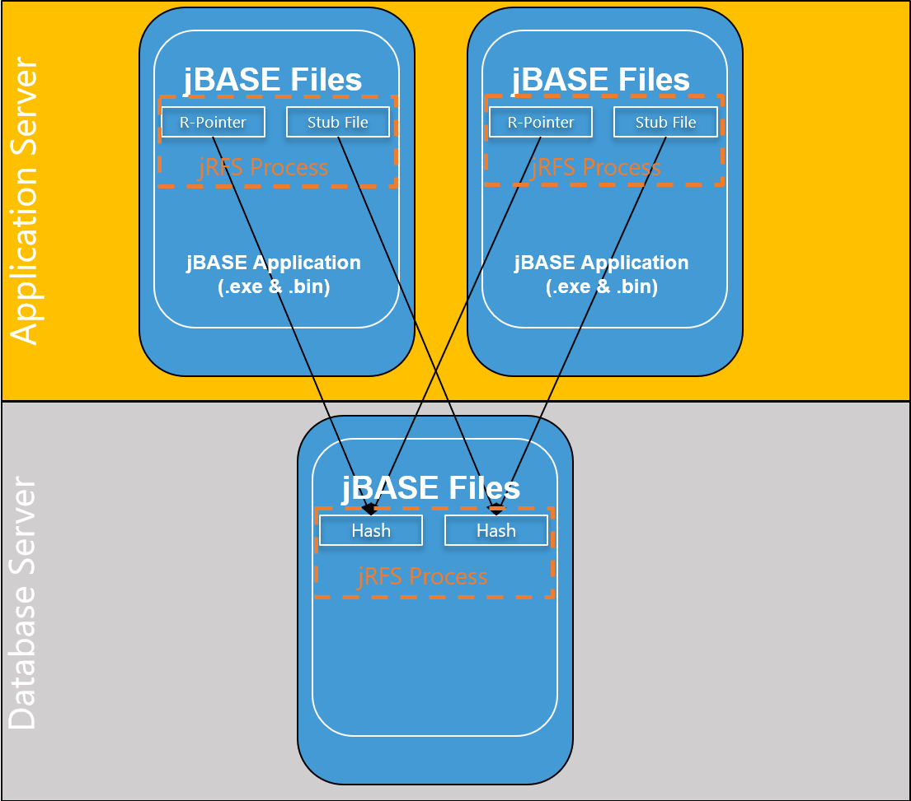

# jBASE Remote File Service (jRFS)

**Created At:** 4/2/2018 9:59:09 PM  
**Updated At:** 7/8/2019 11:38:09 PM  
**Original Doc:** [306074-remote-files](https://docs.jbase.com/44204-remote-files/306074-remote-files)  
**Original ID:** 306074  
**Internal:** No  

**Tags:**
<badge text='remote files' vertical='middle' />
<badge text='jrfs' vertical='middle' />

## Description 

The main purpose of jBASE Remote File Service (jRFS) is to allow files to be shared between two machines (a Client and a Server). It consists of a Server program which runs on the machine that hosts the files, and a remote JEDI which will allow the Client machine to access the files stored on the remote server. jRFS also allows jQL Statements to be run on the Host machine via the client. The benefit of this is just the results of the select will be returned over the network to the client hence reducing the network traffic between the host and the client (If using standard file sharing between host and client, the client would need to read all the contents of a file over the network to process the jQL Statement). In addition jRFS allows the execution of programs via the client on the host machine returning any output to the client.

[Configuration Files](./../jrfs-configuration-files)

[jQL and Remote Files](./../jql-and-remote-files)

[Starting jRFS as a Service on Windows](./../starting-jrfs-as-a-service-on-windows)

[Creating Stub Files](./../creating-stub-files)

[Creating Remote Pointers](./../creating-remote-pointers)

[Access Security](./../access-security)

[jRFS Example Configuration](./../jrfs-example)

[jRFS Quick Start](./../jrfs-quick-start-guide)

[Return to jBASE Files](./../../jbase-files)

  
<PageFooter />
