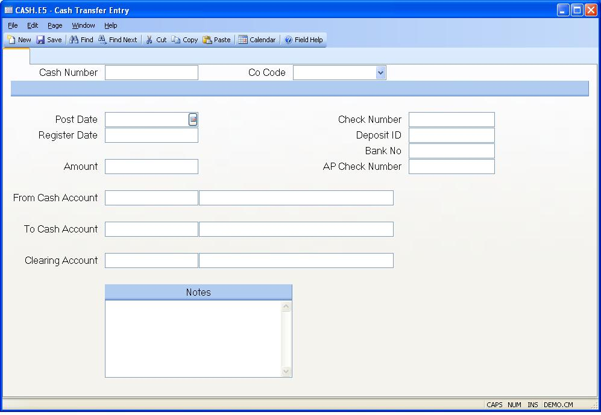

##  Cash Transfer Entry (CASH.E5)

<PageHeader />

##

**Cash#** If you are entering a new cash item, leave this field null and the
next sequential cash number will be assigned at file time.  
  
**Co Code** Enter the company code this record should be issued to. The
company code must be predefined in the CO.CONTROL procedure. If only one code
exists, it will automatically be inserted into the procedure.  
  
**Post Date** Enter the date on which the cash is to be posted. This date will
determine the period in the general ledger into which the cash will post.  
  
**Register Date** Enter the date that should be posted to the register (ARREG)
records when reversing the cash record. When creating a cash record, the
register date will be the same as the post date and cannot be changed by the
user. When reversing (or deleting) the cash record, the post date will load
into this field for you but can be changed as required. If the post date falls
into a closed fiscal period, you will need to change this date to one that
falls within an open fiscal period before the record can be deleted.  
  
**Amount** Enter the amount of the cash being transferred.
  
**From Cash Account** Enter the cash account number from which the amount will
be transferred.
  
**Cash.Account** Enter the cash account number into which the amount is to be
transferred.
  
**Accounts** Enter the clearing account number which will be used to offset the cash accounts when this record is filed. This will be defaulted from the [ AR.CONTROL ](../../../../../../../../rover/AP-OVERVIEW/AP-ENTRY/CHECKS-E4/AR-CONTROL) screen if it has been entered there.
  
**Notes** Enter any notes desired.  
  
**Account Desc**  
  
**Account Desc1**  
  
**Account Desc2**  
  
**Check Number** If the transfer being processed was a check, enter the check
number here. For cash or electronic transfer you may either enter "CASH" or
some other designation here, or leave this field empty.  
  
**Deposit ID** This optional field may be used to group a series of cash entries by a common deposit number and later print them on a single cash deposit report. Deposit slips may, also, be printed via [ CASH.F1 ](../../../../../../../../rover/AP-OVERVIEW/AP-ENTRY/ACCT-CONTROL/ACCT-CONTROL-2/CASH-F1) . If you will be using [ RECON.E ](../../../../../../../../rover/AP-OVERVIEW/AP-ENTRY/ACCT-CONTROL/ACCT-CONTROL-1/ar-e/AR-E-1/CASH-E/CASH-E-1/RECON-E) to reconcile your bank statements, a deposit id is recommended.   
  
**Bank Number** Enter the bank number for this cash transaction. This number will print on the deposit slip form , [ CASH.F1 ](../../../../../../../../rover/AP-OVERVIEW/AP-ENTRY/ACCT-CONTROL/ACCT-CONTROL-2/CASH-F1) .   
  
**AP Check Number** You may optionally enter the check number that will be
created to offset the cash entry. This check number must not exist in the
CHECKS file. If not entered, a number will be generated prefixed by "T" to use
as the check ID.  
  
  
<badge text= "Version 8.10.57" vertical="middle" />

<PageFooter />