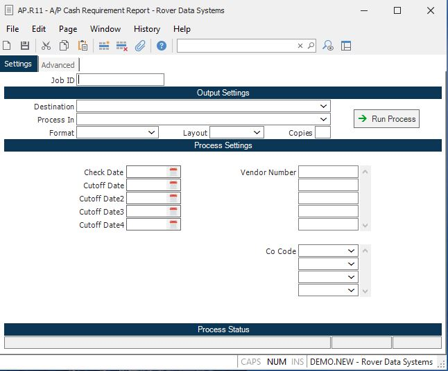

##  A/P Cash Requirement Report (AP.R11)

<PageHeader />

##

**Job ID** Enter a unique ID if you wish to enter and save the parameters to
this procedure for future use. If you only need to run the procedure and do
not want to save your entry then you may leave this field empty.  
  
**Destination** Select the destination for the output from this procedure.  
  
**Process** Select the method to be used for processing the report. Foreground
is always available and must be used when output is directed to anything other
than a system printer (i.e. printers spooled through the database on the host
computer.) Depending on your setup there may be various batch process queues
available in the list that allow you to submit the job for processing in the
background or at a predefined time such as overnight. A system printer must be
specified when using these queues.  
  
**Format** Select the format for the output. The availability of other formats
depends on what is allowed by each procedure. Possible formats include Text,
Excel, Word, PDF, HTML, Comma delimited and Tab delimited.  
  
**Layout** You may indicate the layout of the printed page by specifying the
appropriate setting in this field. Set the value to Portrait if the page is to
be oriented with the shorter dimension (usually 8.5 inches) at the top or
Landscape if the longer dimension (usually 11 inches) is to be at the top.
Portrait will always be available but Landscape is dependent on the output
destination and may not be available in all cases.  
  
**Copies** Enter the number of copies to be printed.  
  
**Run Process** Click on the button to run the process. This performs the save
function which may also be activated by clicking the save button in the tool
bar or pressing the F9 key or Ctrl+S.  
  
**Check Date** Enter date check run will be processed.  
  
**Cutoff Date** Enter the date to be used as the cutoff date for this report.
Invoices with a net due date <= to Cutoff.Date1 will appear in this column.
This date should not be >= to Cutoff.Date2, etc. and cannot be deleted if data
exists for Cutoff.Date2.  
  
**Cutoff Date2** Enter the date to be used as the cutoff date for this report.
All invoices with a net due date > Cutoff.Date1 and <= Cutoff.Date2 will
appear in this column. The date should not be >= Cutoff.Date3 and cannot be
deleted if data exists for Cutoff.Date3.  
  
**Cutoff Date3** Enter the date to be used as the cutoff date for this report.
All invoices with a net due date > Cutoff.Date2 and <= Cutoff.Date3 will
appear in this column. The date should not be >= Cutoff.Date4 and cannot be
deleted if data exists for Cutoff.Date4.  
  
**Cutoff Date4** Enter the date to be used as the cutoff date for this report.
All invoices with a net due date > Cutoff.Date3 and <= Cutoff.Date4 will
appear in this column.  
  
**Last Status Message** Contains the last status message generated by the
program.  
  
**Last Status Date** The date on which the last status message was generated.  
  
**Last Status Time** The time at which the last status message was generated.  
  
**Vendor Number** Enter specified vendors for which this report should print
or leave blank to print for all vendors.  
  
**Co Code** Enter the company codes you wish to appear on this report. If left
blank all company codes will be included.  
  
  
<badge text= "Version 8.10.57" vertical="middle" />

<PageFooter />