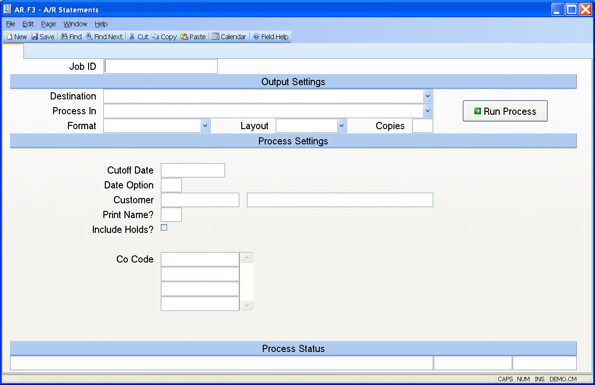

##  A/R Statements (AR.F3)

<PageHeader />

##

**Job ID** Enter a unique ID if you wish to enter and save the parameters to
this procedure for future use. If you only need to run the procedure and do
not want to save your entry then you may leave this field empty.  
  
**Destination** Select the destination for the output from this procedure.  
  
**Process** Select the method to be used for processing the report. Foreground
is always available and must be used when output is directed to anything other
than a system printer (i.e. printers spooled through the database on the host
computer.) Depending on your setup there may be various batch process queues
available in the list that allow you to submit the job for processing in the
background or at a predefined time such as overnight. A system printer must be
specified when using these queues.  
  
**Format** Select the format for the output. The availability of other formats
depends on what is allowed by each procedure. Possible formats include Text,
Excel, Word, PDF, HTML, Comma delimited and Tab delimited.  
  
**Layout** You may indicate the layout of the printed page by specifying the
appropriate setting in this field. Set the value to Portrait if the page is to
be oriented with the shorter dimension (usually 8.5 inches) at the top or
Landscape if the longer dimension (usually 11 inches) is to be at the top.
Portrait will always be available but Landscape is dependent on the output
destination and may not be available in all cases.  
  
**Copies** Enter the number of copies to be printed.  
  
**Run Process** Click on the button to run the process. This performs the save
function which may also be activated by clicking the save button in the tool
bar or pressing the F9 key or Ctrl+S.  
  
**Cutoff.Date** Enter the cutoff date to be used for the selection of invoices
to appear on this statement run. All unpaid invoices due before this date will
be selected for this statement run.  
  
**Date Option** If you wish to select all open items with an invoice date less
than or equal to the cutoff date, then enter 'I'. To use the due date, enter
'D'. Using due date could cause invoices for the current period which are not
due until after the cutoff date to NOT appear on the statements.  
  
If the terms code posted to the a/r record allows for split due dates, the due
date used in this report will be based on the terms code and will not be the
due date posted to the a/r record.  
  
**Customer** Enter the customer number for which you wish to print a
statement. If you wish to print  
statements for all customers, leave this field null. If you do not know the
customer number, there is an option in the help menu for this prompt which
allows you to select a customer by name.  
  
**Name** This field contains the customer name is it appears in the CUST file.  
  
**Print Name?** This field allows the user to optionally suppress the printing
of the company name in the upper left corner of the statement form. This can
be used to print statements on letterhead-type forms where the company name is
already present.  
  
**Include Holds?** Check this box if you wish to include invoices that have
been flagged as on hold on the statement.  
  
**Company Code** Enter the company codes you wish to appear on this statement.
If left blank all company codes will be included. If more than 1 company code
is selected the corporate address will be printed on the form.  
  
**Last Status Message** Contains the last status message generated by the
program.  
  
**Last Status Date** The date on which the last status message was generated.  
  
**Last Status Time** The time at which the last status message was generated.  
  
  
<badge text= "Version 8.10.57" vertical="middle" />

<PageFooter />