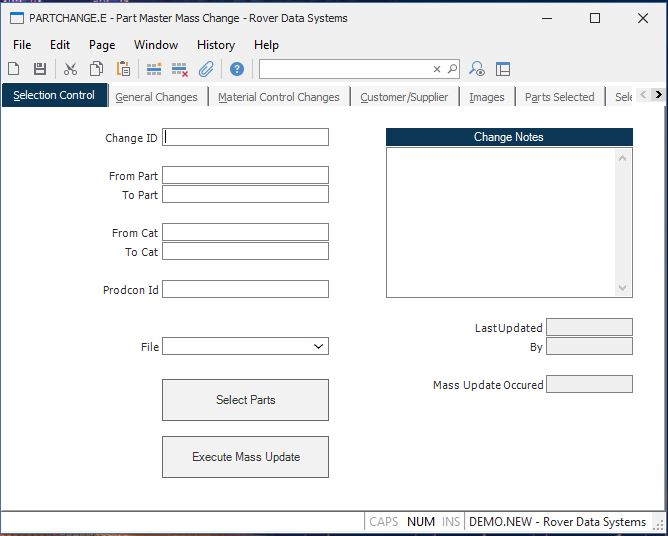

##  Part Master Mass Change (PARTCHANGE.E)

<PageHeader />

##  Selection Control

**Change ID** Enter an ID to be used to save the set of change criteria to be
entered or leave blank to have the system assign an ID.  
  
**From Part**  
  
**To Part**  
  
**From Cat** If you wish to select parts based on a range of categories, enter
the starting category in this field.  
  
**To Cat** If you wish to select parts based on a range of categories, enter
the ending category in this field.  
  
**Prodcon Id** If you wish to select parts that were created from a prodcon
(i.e. configuration) id, enter the PRODCON.ID in this field.  
  
**File Path** Enter the path where the below file is saved. This path must be
visible from the server. An example of the format is: nt:/d:/transfer. This
format allows D3 to open the file directly.  
  
**Test File** If you wish to load in parts from a text file, enter the file
name here. The file should be saved as a tab, delimited text file. When
entering in the file name, include the file extension (.txt) The first column
in the file should contain the part number and there should be no header field
in the file. When selecting parts from a file, the data in the 'from part',
'to part', 'from cat' and 'to cat' fields will be ignored.  
  
**Select Parts**  
  
**Execute Mass Update**  
  
**Change Notes** Enter any notes to describe the purpose of this change.  
  
**Stamp Date** The date the record was changed. This field is displayed for
reference only and cannot be changed.  
  
**Stamp User** The user id of the individual who last updated the record. This
field is displayed for reference and cannot be changed.  
  
**Post Date** The date the mass change was effective.  
  
  
<badge text= "Version 8.10.57" vertical="middle" />

<PageFooter />