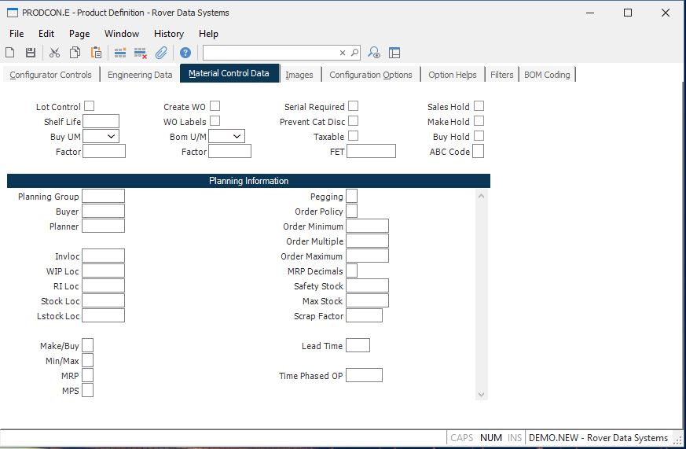

##  Product Definition (PRODCON.E)

<PageHeader />

##  Material Control Data

**Lot Control** Check here if the configured parts are to be lot controlled.  
  
**Shelf Life** Enter the shelf life in days for the product if applicable.  
  
**Buy UM** Enter the unit of measure to be used as the vendor's unit of
measure if the part is purchased.  
  
**Buy Factor** Enter factor to be used for converting the quantities of the
part from the vendor's unit of measure to the stocking unit of measure.  
  
**Create Wo** Check here if the parts created by this configuration should
automatically create work orders during the sales order process.  
  
**WO Labels** Check here if the configured items will be called out on other
bills of material, and you want a picking label printed for them.  
  
**Bom U/M** This is the bill of material unit of measure which will be displayed in [ BOM.E ](../../../../../rover/AP-OVERVIEW/AP-ENTRY/AP-E/AP-E-2/INV-CONTROL/INV-CONTROL-1/COST-P2/COST-P1/COST-E/BOM-E) . The quantity entered for this part in [ BOM.E ](../../../../../rover/AP-OVERVIEW/AP-ENTRY/AP-E/AP-E-2/INV-CONTROL/INV-CONTROL-1/COST-P2/COST-P1/COST-E/BOM-E) will be in the BOM U/M.   
  
**Bom Um Factor** Enter the factor to be used in conjunction with the Bill of Material unit of measure to convert to stock units of measure in [ BOM.E ](../../../../../rover/AP-OVERVIEW/AP-ENTRY/AP-E/AP-E-2/INV-CONTROL/INV-CONTROL-1/COST-P2/COST-P1/COST-E/BOM-E) . For example, if you were stocking this part in feet, but wanted to define the quantity to be used per next assembly in inches, then you would enter 12 in this field.   
  
**Serial Rqd** Check here if a serial number must be designated when the part is sold through [ PSO.E ](../../../../../rover/AP-OVERVIEW/AP-ENTRY/AP-E/AP-E-1/MSHIP-E/MSHIP-E-2/Parts-E/PARTS-E-2/PSO-E) .   
  
**No Cat Disc** Check here if this part should not receive its normal category discount found in [ CAT.CONTROL ](../../../../../rover/AP-OVERVIEW/AP-ENTRY/AP-E/AP-E-1/MSHIP-E/MSHIP-E-2/Parts-E/PARTS-E-2/CAT-CONTROL) when sales occur in [ PSO.E ](../../../../../rover/AP-OVERVIEW/AP-ENTRY/AP-E/AP-E-1/MSHIP-E/MSHIP-E-2/Parts-E/PARTS-E-2/PSO-E) .   
  
**Taxable** Check here if the part is to be shown as taxable on a POS order.  
  
**Fet** Enter the amount of Federal Excise Tax which is to be charged each
time this part is sold.  
  
**Sales Hold** Check this box if sales of the part number are not allowed.  
  
**Make Hold** Check this box if users are to be prevented from generating work
orders for the part number.  
  
**Buy Hold** Check this box if users are to be restricted from creating
purchase orders for the part number.  
  
**ABC Code** You may pre-define the ABC code to be used for each configured
part, or let them be assigned by the batch ABC stratification procedure. Valid
entries are:  
A - High cost and/or usage, or long lead time  
B - Medium cost, usage or lead time  
C - Low cost, usage and easy to  
  
**Plan Group** Enter the planning group under which the subsequent fields will
be controlled. MRP and MPS procedures will access this data, based upon the
planning group specified.  
  
**Buyer** Enter the code used to define the buyer who will be responsible for
purchasing the product.  
  
**Planner** Enter the code used to define the planner who is responsible for
planning the product.  
  
**Invloc** Enter the inventory location to be used as the parts home location.  
  
**WIP Loc** Enter the work in process location normally used to create this
part. This field will be defaulted into the work order.  
  
**RI Loc** Enter the inventory location to be used as the receiving location. If this location is different than the inventory location, this field will be defaulted into [ PO.E ](../../../../../rover/AP-OVERVIEW/AP-ENTRY/AP-E/AP-E-1/CURRENCY-CONTROL/PO-E) line items as the inspection location. If this field is left empty, the home inventory location will be used.   
  
**Stock Loc** Enter the default stockroom location for which materials will be
pulled when a work order is created for this part.  
  
**Lstock Loc** The default location from which line stock items will be pulled
when a work order/picker is created for this part.  
  
**Make/Buy** Enter one of the following codes which defines if the configured
parts will be purchased or made in-house.  
M - Make item  
B - Buy item  
C - Combination make or  
  
**Min/Max** Enter the letter "Y" if the configured parts are to by planned
with Min/Max reporting.  
  
**MRP** Enter the letter "Y" if the configured parts are to be planned through
MRP.  
  
**MPS** Enter the letter "Y" if the configured parts are to be planned through
MPS.  
  
**Pegging** Enter the letter "Y" if pegging is to be maintained for the
configured parts.  
  
**Order Policy** Enter one of the following order policies:  
F - Fixed, apply order modifiers in MRP/MPS  
D - Discrete, plan only to cover  
  
**Order Min** Enter the minimum order quantity to be planned for the
configured parts.  
  
**Order Mult** Enter the multiple by which additional quantities beyond the
minimum should be added to planned order.  
  
**Order Max** Enter the maximum size that a planned order may be before an
exception message is generated by MRP.  
  
**MRP Decimals** Enter the number of decimal places that will be used by MRP
for requirements and planned order calculations. This will only need to be set
if the part has bill of material quantities in small fractions that result in
gross requirements of less than 1. Leave blank to default MRP calculations in
whole numbers (normal processing). Valid values are 0 through 4.  
  
**Safety Stock** Enter the quantity of safety stock to be kept on-hand for the
configured parts.  
  
**Max Stock** Enter the maximum projected balance that may be calculated by
MRP/MPS before an exception is generated to warn of overstocking.  
  
**Scrap Factor** Enter the factor by which the planned orders are to be
multiplied to account for scrap or yield during the production process.  
  
**Lead Time** Enter the lead time in manufacturing days required to build or
procure the configured parts. You may enter the letter "D" to indicate that
the lead time for assembled parts is to be calculated dynamically based upon
the routing and planned order quantity.  
  
**Time Phased OP** Enter the time phased order quantity to be used in each
period of MRP as forecast demand.  
  
  
<badge text= "Version 8.10.57" vertical="middle" />

<PageFooter />