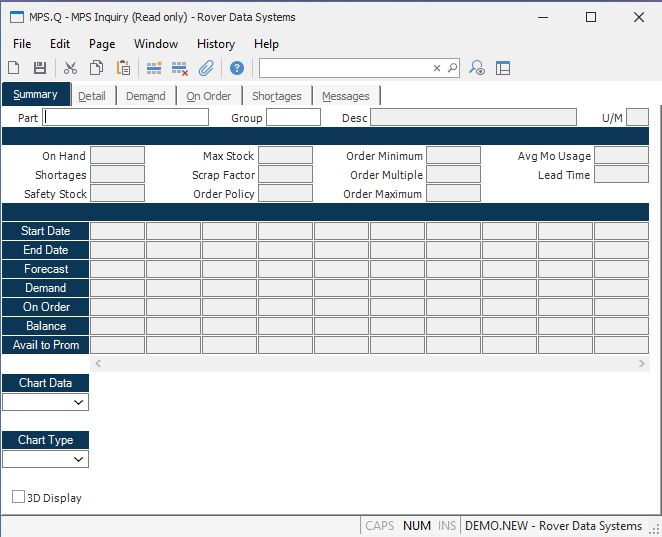

##  MPS Inquiry (MPS.Q)

<PageHeader />

##  Summary

**Part Number** Enter the part number of the item you want to display on the
screen.  
  
**Group** Enter the planning group you wish to display.  
  
**Description** Contains the description of the part as entered in the parts
master.  
  
**Unit of Measure** Contains the stocking unit of measure for the part number
entered.  
  
**On Hand** Contains the inventory balance as it was at the time the MPS
calculations were performed for this part number. The actual on hand balance
may have changed since that time.  
  
**Shortages** Contains the total number of the part which is short on work
orders at the time the MPS was generated. This quantity may not match the
total number of shortages shown on the shortage screen in this procedure since
the contents of that screen are taken from the current data.  
  
**Safety Stock** Contains the minimum quantity of inventory which should be
maintained for the associated part. The initial on hand balance is reduced by
this amount in the MPS calculations.  
  
**Max Stock** Contains the maximum projected inventory balance which is
allowed. Exceptions will be generated if this quantity is exceeded anywhere
within the planning horizon.  
  
**Scrap Factor** Contains the scrap factor to be applied to the gross
requirements. The scrap factor is stated as the percentage of parts which are
expected to be scrapped as a part of normal operations. This is also known as
shrinkage. The system uses this factor to increase demand for the part by the
anticipated shrinkage. The demand generated by the scrap factor will appear as
an individual item in the pegging for the part.  
  
**Order Policy** The order policy should be set to either "Fixed" or
"Discrete". If no order policy has been specified then discrete is assumed.  
  
**Order Minimum** Contains the recommended minimum order quantity for the
associated part number.  
  
**Order Multiple** Contains the recommended order multiple to be used when
calculating order quantities.  
  
**Order Maximum** Specifies the maximum quantity that should be ordered at one
time.  
  
**Average Monthly Usage** Contains the average monthly usage of the part based
on the available transaction history.  
  
**Lead Time** The number of days normally required to produce the associated
part.  
  
**Period Start Date** This field contains the start date for each period and
the associated forecasts, requirements, receipts, projected balance and
available to promise quantities for the period.  
  
**Period End Date** This field contains the end date for each period and the
associated forecast, requirements, receipts, projected balance and available
to promise quantities.  
  
**Forecast** Contains the forecasts for the part number which occur in the
associated period.  
  
**Gross Requirments** Contains the sum of all the requirements for the part
number which occur in the associated period.  
  
**Scheduled Receipts** Contains the sum of all purchase order receipts,
planned completions from work orders and MPS items for the part number in the
associated time period.  
  
**Projected Balance** Contains the current projected on-hand balance less
safety stock for the associated period.  
  
**Available To Promise** Contains the quantity that is available to promise to
customers until the next available quantity.  
  
**Chart Data** Select the source of the data to be displayed in the chart.  
  
**Chart Type** Select the format of the chart to be displayed.  
  
**3D Display** Check this box if the chart is to be displayed in three
dimensional format.  
  
**Chart** Displays a chart of the data specified in the Chart Type prompt.  
  
  
<badge text= "Version 8.10.57" vertical="middle" />

<PageFooter />