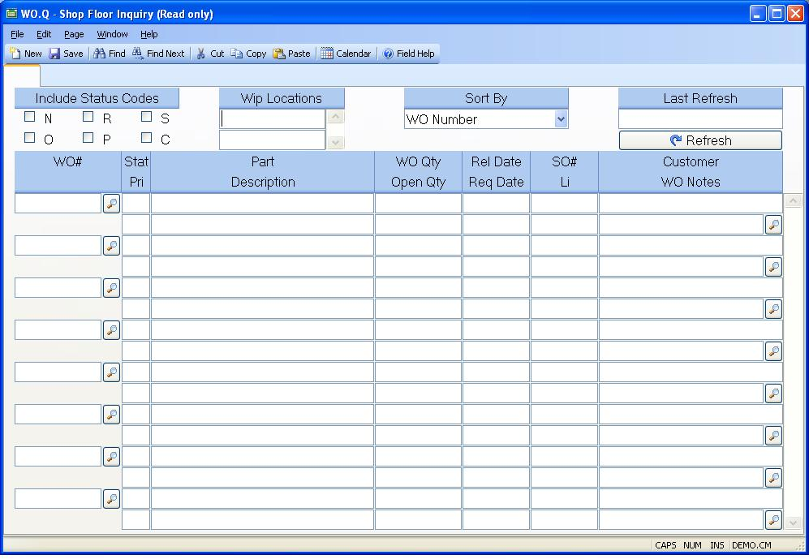

##  Shop Floor Inquiry (WO.Q)

<PageHeader />

##

**ID**  
  
**N** Check this box if you want to include work orders with a status of "N".  
  
**Inclide O** Check this box if you want to include work orders with a status
of "O".  
  
**Include R** Check this box if you want to include work orders with a status
of "R".  
  
**Include P** Check this box if you want to include work orders with a status
of "P".  
  
**Include S** Check this box if you want to include work orders with a status
of "S".  
  
**Include C** Check this box if you want to include work orders with a status
of "C".  
  
**Wip Locations** If you wish to limit this screen to work orders for specific
wip (work in process) locations, enter those locations in this field. To
include all locations, leave this field blank.  
  
**Sort By** Select the sort method that will be used to display the work
orders.  
  
**Last Refresh** This field contains the last date and time that the data was
refreshed on the screen.  
  
**WO** This field contains the WO number.  
  
**WO Status** This field contains the current status of the work order, at the
time the data was refreshed.  
  
**WO Priority** This field contains the priority assigned to the work order.  
  
**Part number** This field displays the part/assembly of the work order.  
  
**Description** This field contains the description of the part/assembly, as originally loaded into [ WO.E ](../../../../../rover/AP-OVERVIEW/AP-ENTRY/AP-E/CHECKS-E/AP-CONTROL/GLCHART-E/GLCHART-E-1/GLCHART-R2/WO-CONTROL/WO-E) when the work order was created. To display the entire description in a text box, right-click or double click in the description field.   
  
**WO Qty** This field contains the work order quantity, representing the
number of units to be built.  
  
**Open Qty** This field contains the current open quantity. This is the total
WO quantity, less any completions and scraps.  
  
**Rel Date** The date displayed here is the current release date found on the
WO.  
  
**Req Date** The date displayed here is the current required or scheduled
completion date found on the WO.  
  
**SO number** This field contains the sales order number to which the
associated work order is linked.  
  
**SO Li** This field contains the line item of the sales order.  
  
**Customer** This field contains the customer name, as found in the work order
record. This will only be present if the work order was generated for a
specific customer.  
  
**Notes** This field contains the work order notes. To view the notes in a
text box, press the inquiry button to the right.  
  
**WO.E** You may press this button to automatically invoke the [ WO.E ](../../../../../rover/AP-OVERVIEW/AP-ENTRY/AP-E/CHECKS-E/AP-CONTROL/GLCHART-E/GLCHART-E-1/GLCHART-R2/WO-CONTROL/WO-E) screen for the associated work order.   
  
**Notes** Press this button to display the work order notes in a text box.  
  
**Refresh** Press this button to refresh the data on the screen according to
the options selected.  
  
  
<badge text= "Version 8.10.57" vertical="middle" />

<PageFooter />