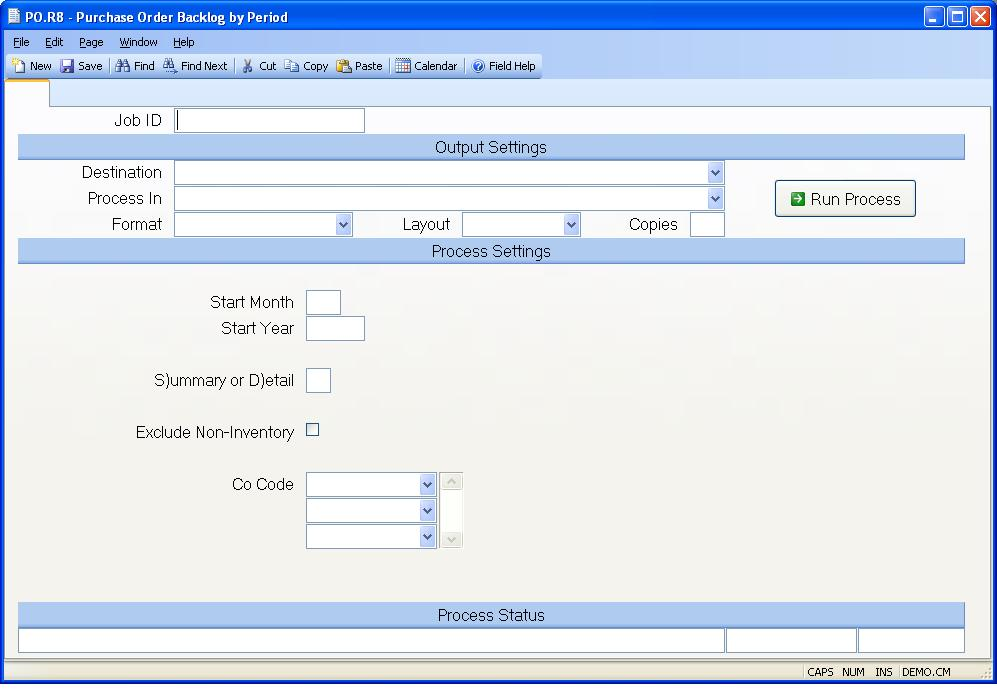

##  Purchase Order Backlog by Period (PO.R8)

<PageHeader />

##

**Job ID** Enter a unique ID if you wish to enter and save the parameters to
this procedure for future use. If you only need to run the procedure and do
not want to save your entry then you may leave this field empty.  
  
**Destination** Select the destination for the output from this procedure.  
  
**Process** Select the method to be used for processing the report. Foreground
is always available and must be used when output is directed to anything other
than a system printer (i.e. printers spooled through the database on the host
computer.) Depending on your setup there may be various batch process queues
available in the list that allow you to submit the job for processing in the
background or at a predefined time such as overnight. A system printer must be
specified when using these queues.  
  
**Format** Select the format for the output. The availability of other formats
depends on what is allowed by each procedure. Possible formats include Text,
Excel, Word, PDF, HTML, Comma delimited and Tab delimited.  
  
**Layout** You may indicate the layout of the printed page by specifying the
appropriate setting in this field. Set the value to Portrait if the page is to
be oriented with the shorter dimension (usually 8.5 inches) at the top or
Landscape if the longer dimension (usually 11 inches) is to be at the top.
Portrait will always be available but Landscape is dependent on the output
destination and may not be available in all cases.  
  
**Copies** Enter the number of copies to be printed.  
  
**Run Process** Click on the button to run the process. This performs the save
function which may also be activated by clicking the save button in the tool
bar or pressing the F9 key or Ctrl+S.  
  
**Start Month** Enter the number of the month to be used as the first period
in the report. For example, enter 1 for January, 2 for February etc.  
  
**Start Year** Enter the year to use along with the month in the previous
prompt to define the first period. You must enter the full year such as 1990.  
  
**S)ummary or D)etail?** Enter the letter "D" if you want to include the
detail data for each part number. Enter "S" to show the summary totals only.  
  
**Co Code** Enter the company codes you wish to appear on this report. If left
blank all company codes will be included.  
  
**Last Status Message** Contains the last status message generated by the
program.  
  
**Last Status Date** The date on which the last status message was generated.  
  
**Last Status Time** The time at which the last status message was generated.  
  
**Exclude Non-Inventory** If you wish to exclude non-inventory items from this
report, check this box. Non-inventory items are purchase order lines which do
not contain a part number.  
  
  
<badge text= "Version 8.10.57" vertical="middle" />

<PageFooter />