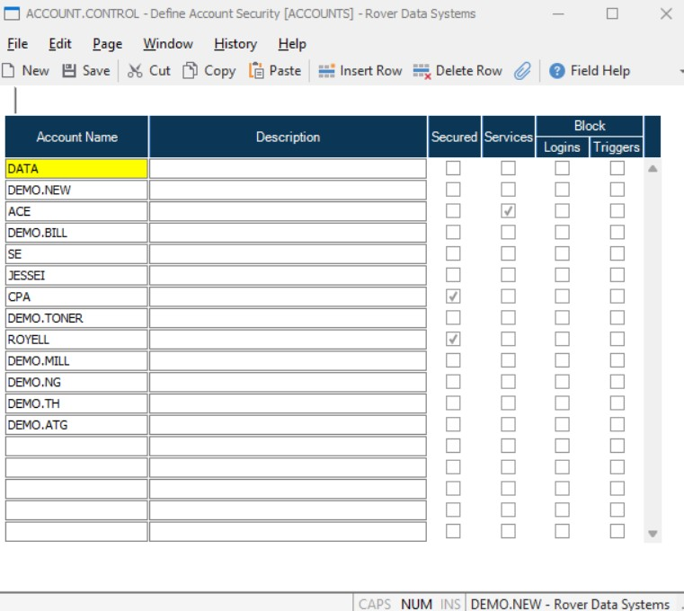

# Enabling Account Security (ACCOUNT.CONTROL)

<PageHeader />

<badge text= "Version 8.10.57 " vertical="middle" />

## Purpose

In Rover, your database is known as your account. The `ACCOUNT.CONTROL` procedure is used indicate that an account is to be secured for all users. This allows the System Administrator to specify that security is needed on an account by account basis. Each account must be entered with a `Y` in order to secure the account. Accounts either not listed, or which do not contain a `Y` are considered un-secured.

Accounts which are not secured will, upon user login, allow the entry of any user ID and not prompt for a password. Also, users who exit the menu (e.g. press the `F1` key) will be left at the system level command prompt.

When security is enabled for an account, the user will be prompted for a password after they enter their user ID. This entry will be validated against their password in their user profile to verify access to the account. When secured, users exiting the menu (e.g. pressing the `F1` key) are logged off.

> WARNING: It is highly recommended to enable security on production accounts.

## Prerequisites

All users and their security profiles must be entered via the `SECURITY.E` procedure.
<!-- TODO: Add link to SECURITY.E article -->

## Usage

<!-- TODO: Update screenshot above and prompts below -->

- The `ID` of this record is always defaulted by the system as _ACCOUNTS_.
- `Account Name` Enter the name of each account on the system that you want to
set security on now or in the future. The accounts do not have to present on
the system at the time they are entered here.
- `Secured` Check this box if the associated account is to be under the
control of security.
- `Services` Check this box if services in the associated account are to be
started automatically during a system restart.
- `Block` Check this box if users are to be blocked from logging into the
associated account. This only applies to users whose security profile is set
to _USER_. Administrators and programmers are not blocked.

<PageFooter />
