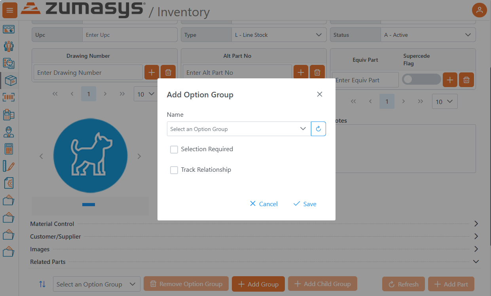
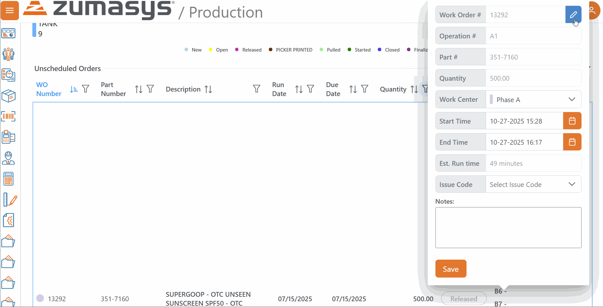
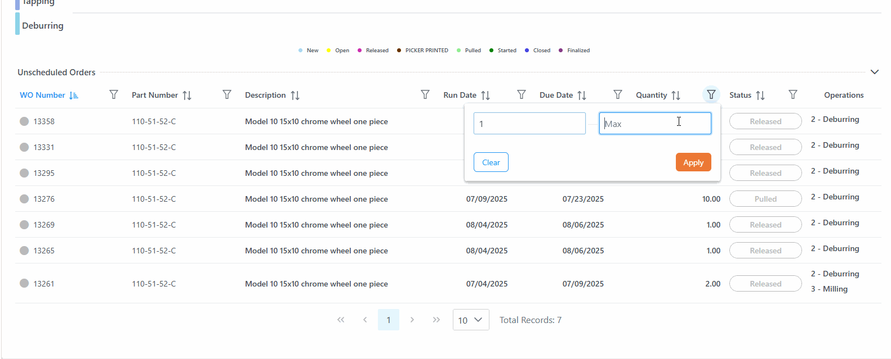

# Rover Web v2.17.0 Release Notes

<badge text= "Version 2.17.0" vertical="middle" />

<PageHeader />

These are the release notes for version 2.17.0 (10/27/2025) of the Rover Web application and can be made available to customers running _Rover ERP_, _IMACS_ and other non-Zumasys owned systems. Contact your _Client Success Manager_, [Sales](mailto:sales@zumasys.com?subject=Rover%20Web%20v2.17.0) or [Support](mailto:help@zumasys.com?subject=Rover%20Web%20v2.17.0) today!

## New Features

### Rover Web

#### Inventory

  - Option groups can now be refreshed without the need to log out and back into Rover Web.

  

#### Production Scheduling

 - Added a clickable link from the Bar Overlay in work order scheduling to link to the work order details.

 
 
  - The quantity filter in the Unscheduled Orders supports a number range, rather than a single value.

 
 - The default search date range for the Production Board has been changed from Sunday through Saturday of this week to today through Saturday, reducing unnecessary display from days past.
 - The Production Board data tables no longer have pagination, all data is displayed immediately providing greater access to the data.

### Rover Portal

#### Orders

  - Related parts are now supported in Rover Portal for Orders in alignment with Sales Quote related parts in Rover Web.

## Bug Fixes

### Rover Web

#### Inventory

  - Option groups are now refreshed at login. Previously, cached values blocked new items from being read.

#### Production Scheduling

 - Corrected an issue that could cause the Scheduled Orders Gantt Chart's search button to get stuck on a loading spinner

#### Scan

  - Addressed issue with the title of scan forms flashing to incorrect values and reverting to "Scan".

### Rover Portal

#### Invoices

  - Resolved issue with ACH payment not allowing account numbers with leading zeros.  Additional UI cleanup to make field validation more clear.
  
<PageFooter />
